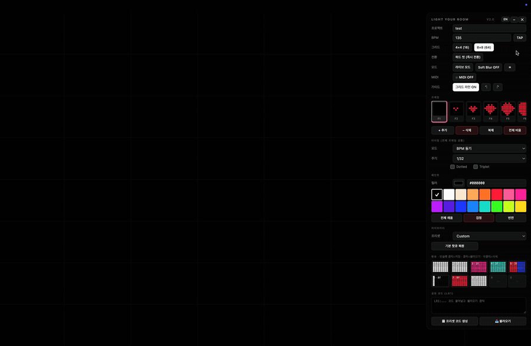

# Light Your Room

**BPM-synced lighting in a single HTML file — paint light frames, trigger them like CDJ hotcues, and run them fullscreen as a face light. No install.**

[**▶ Try it live — lightyourroom.com**](https://lightyourroom.com) · zero dependencies · works offline



> 브라우저 단일 HTML 라이팅 툴. 프레임을 그리고, CDJ 핫큐처럼 트리거하고, 풀스크린 페이스 라이트로. 설치 불필요.

---

## 60 seconds to your first light show

1. **Open it** — `lightyourroom.html` in any browser (or [lightyourroom.com](https://lightyourroom.com)). Nothing to install.
2. **Paint frames** — block out colors on a 4×4 / 8×8 grid; chain them with hard cuts or crossfades.
3. **Trigger live** — fire frames as hotcues (keyboard or MIDI), lock them to BPM, or auto-trigger from a track's markers — then `F` for fullscreen on a second monitor as your face light.

That's the whole loop. Everything below is depth, not setup.

---

## What it's for

A **browser-based lighting sequencer for DJs and creators.** One file, no rig, no software:

- **Face light for camera** — fullscreen on a second monitor for TikTok / Reels / dark-room self-shooting, reacting to your track.
- **Live visuals** — trigger cues by keyboard or MIDI pad (MPC / MPD / Launchpad) like a lighting deck.
- **Festival-style patterns** — BPM-locked strobes, chases, and color washes driven by an audio track.

## Features

- **Grid frame editor** — 4×4 / 8×8, hard-cut or crossfade transitions
- **BPM / Time timing** — 4 bars → 1/64, dotted & triplet
- **Hotcues** — keyboard (10 slots) or **MIDI mode** (4×4 × banks A/B/C = 48 slots; MPC / MPD / Launchpad)
- **Track panel** — load mp3/wav, waveform, drop markers, auto-trigger hotcues on playback, zoom / trim / loop, drag & drop
- **Preset library** — 30 built-in presets across 5 categories
- **Community presets** — publish / search / upvote, served from the same domain (optional; see below)
- **4 languages** — English (default) / Korean / Japanese / Chinese, auto-detected by region & browser, manual toggle (remembered)
- **Share** — LR1 share codes + `.lroom` project files
- **Live Mode** — hide all UI, click to return

### Shortcuts

`Space` play · `E` Live Mode · `G` Guide · `B` Soft Blur · `H` Panel · `T` Track · `C` Community · `F` Fullscreen · `←→` Frame · `N` new frame · `Shift+N` duplicate · `Cmd/Ctrl+Z` undo · `1~9,0` hotcues (keyboard mode) · `Shift+num` save

> ⚠️ **Photosensitivity warning** — Strobe/flicker effects can trigger seizures. Don't use if you have a history of photosensitive epilepsy.

---

## Privacy

The core tool is a **static HTML file that runs entirely in your browser.** No camera, no microphone, no accounts, no tracking, no analytics. Open it offline and it works.

The **only** thing that talks to a server is the optional Community preset feature — it sends a preset's grid data + a nickname when you choose to publish or browse. Don't want any network at all? Just open the local HTML file and ignore the Community tab.

---

## Self-host the community backend (optional)

The core tool needs no server. Only the preset-sharing feature does — it runs on
**Cloudflare Pages + D1** (free tier). To host your own instance:

1. `npm i -g wrangler && wrangler login`
2. `wrangler d1 create <your_db_name>`
3. In `wrangler.toml`, replace `database_id` with **your own** D1 id (the one in this repo is the official instance's and won't work for you).
4. `wrangler d1 execute <your_db_name> --remote --file=schema.sql`
5. `cp lightyourroom.html public/index.html`
6. `wrangler pages deploy --project-name <your_project>`

Optional hardening:

- `wrangler pages secret put ADMIN_KEY` — force-delete any preset via `POST /api/delete {id, adminKey}`.
- `wrangler pages secret put TURNSTILE_SECRET` + set `TURNSTILE_SITEKEY` in `lightyourroom.html` — Cloudflare Turnstile bot protection (works without it; the check is skipped when unset).
- `wrangler pages secret put PW_SALT` — overrides the in-code hash salt for delete passwords.

### Architecture

```
lightyourroom.html      source of truth (edit this)
public/index.html       deploy artifact (copy of the above)
functions/api/
  presets.js            GET list/search · POST create
  vote.js               POST upvote (IP+ASN dedup, datacenter/VPN block)
  delete.js             POST delete (author password or admin key)
  geo.js                GET visitor country (for language auto-detect)
  _lib.js               shared: hashing, Turnstile, abuse heuristics
schema.sql              D1 schema (presets, votes)
```

Abuse defense (free tier, no Bot Management): no free-text body (title + nick only), IP+ASN vote dedup, datacenter/VPN ASN heuristic block, per-IP rate limit, duplicate-preset-hash block, title link/promo filter, optional Turnstile.

---

## Contributing

Issues and PRs welcome. Edit `lightyourroom.html` (the single source), then
`cp lightyourroom.html public/index.html` before deploying.

This is a community project, but **[lightyourroom.com](https://lightyourroom.com) stays
the canonical instance** — forks are welcome, just keep them clearly distinct.

## License

MIT © 2026 IÖN (Gyujeong Park) · [@ion.the.way](https://instagram.com/ion.the.way) · See [LICENSE](./LICENSE).
